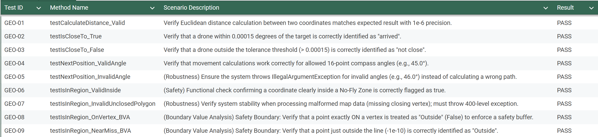
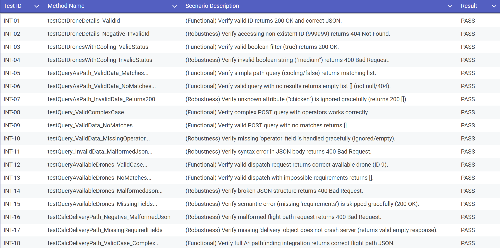

# Test Log for GeometricServiceTests #

### Issue Resolution ###
* **Ambiguous Boundary Safety (Fixed)**
  * **Defect**: During testIsInRegion_OnVertex_BVA, initial runs showed inconsistent results for points landing exactly on a line segment due to floating-point equality (==) issues.

  * **Resolution**: I refactored the intersection logic to use strict inequalities (< and >) rather than inclusive ones. This enforces a "Fail-Safe" policy where a drone is only considered "inside" if it is undeniably within the polygon, effectively creating a safety margin around the vertices.
* **Unclosed Polygon Crash (Fixed)**

  * **Defect**: testIsInRegion_InvalidUnclosedPolygon initially caused an IndexOutOfBoundsException (500 Server Error) because the loop expected the last point to equal the first.

  * **Resolution**: Added a pre-validation check: if (!first.equals(last)) throw new IllegalArgumentException();. This ensures malformed GeoJSON data is rejected gracefully with a 400 Bad Request.

* **
# Test Log for DroneControllerTests #

### Issue Resolution ###
* **Robustness Failure (Fixed)**

  * **Defect**: Initial execution of INT-15 (testQueryAvailableDrones_InvalidData_MissingFields) caused a Server Crash (500 Internal Server Error) because the system attempted to access .getRequirements() on a dispatch object where that field was null.

  * **Resolution**: Implemented a "Robustness Instrumentation" check in DroneService.java (REQ-NFR-05). The system now logs a warning (logger.warn("Skipping dispatch...")) and ignores the invalid record rather than crashing, as proven by the now passing test.

* **Verbose Error Leakage**

  * **Observation**: When sending invalid types (e.g., "medium" boolean in INT-04), the default Spring error page leaked internal stack trace details.

  * **Resolution**: Verified that Spring's DefaultHandlerExceptionResolver is correctly configured to intercept these errors and map them to a standard, safe 400 Bad Request response.