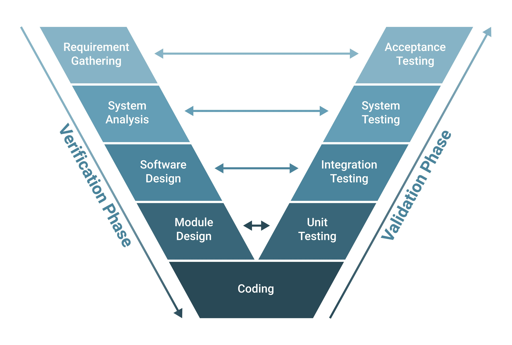

# Test Planning Document: ILP Drone Service

This document outlines the factors constraining when and how specific requirements are analysed and tested, mapping them to a defined software lifecycle.

## 1. Priority and Pre-requisites
We assign limited testing resources based on the priority and risk level of each requirement.

### REQ-GEO-04: Restricted Area Detection (High Priority)
* **Assessment:** This is a safety requirement; failure could lead to illegal drone operation in no-fly zones.
* **Quality Level:** High confidence is required due to the regulatory nature of airspace safety.
* **A&T Needs:** High priority suggests at least two T&A approaches. We will use:
    1. **Formal Inspection:** Reviewing the logic in `isPointInPolygon` to ensure the crossing logic correctly handles edge cases like vertices.
    2. **Automated Boundary Testing:** Using Boundary Value Analysis (BVA) to test coordinates exactly on or near the polygon edges.
* **Pre-requisites:** Requires a complete implementation of the `GeometricService` logic and defined `Region` and `Position` DTOs.
* **Testing Window:** Testing is possible early in the development lifecycle at the component (unit) level.
* **Goal Test Coverage:** 100% statement coverage alongside 100% branch coverage

### REQ-NFR-05: API Robustness - DroneController (High Priority)
* **Assessment:** Critical for system viability and reliability; the service must handle invalid inputs without exposing stack traces or crashing.
* **Quality Level:** High reliability is required to prevent system-wide 500 errors during malformed data injection.
* **A&T Needs:** Tri-state Negative Testing via `MockMvc` scaffolding to verify specific response mappings:
    1. **400 Bad Request:** For syntactically malformed JSON or missing required fields like `attribute` or `operator`.
    2. **200 OK:** For valid queries that result in no matches, returning an empty list `[]`.
    3. **404 Not Found:** Exclusively for `@GetMapping("/droneDetails/{id}")` when a valid ID format is provided but no drone exists in the system.
* **Pre-requisites:** Requires the `DroneController` and the `MedDispatchRec` data structures to be implemented.
* **Testing Window:** This is possible once the controller endpoints are established and integrated with the Spring framework.
* **Goal Test Coverage:** 100% statement coverage

---

## 2. Scaffolding and Instrumentation
Instrumentation code makes important internal information visible to the tester, while scaffolding code allows components to be tested in isolation.

### Instrumentation
* **Crossing-Count Visibility (REQ-GEO-04):** We will instrument the `isPointInPolygon` method in `GeometricService.java` with diagnostic logging to expose the internal `crossings` count during test execution. This makes information visible that might otherwise be difficult to access during automated testing.
* **Rejection Audit Logging (REQ-NFR-05):** We will instrument the `matchesAttribute2` method in `DroneService.java` with an SLF4J logging framework. The system will log a diagnostic **WARN** message whenever a null field triggers a rejection, allowing the tester to verify that a **400 Bad Request** was caused by intended data validation rather than a general system failure.

### Scaffolding
* **Unit Test Drivers (REQ-GEO-04):** We will build JUnit test drivers to present synthetic boundary coordinates to the service and check that results meet the specification.
* **MockMvc Driver (REQ-NFR-05):** We will use `MockMvc` as scaffolding to simulate the hardware/API interface. This allows us to present malformed JSON payloads and missing fields to the `DroneController` to verify the correct HTTP status codes without needing a live server deployment.
* **IlpClient Mock:** A mock implementation of `IlpClient` will serve as scaffolding to simulate the external REST service, allowing for early testing of the `DroneService` logic.

---

## 3. Process and Risk
We map these testing tasks into a V-Model lifecycle to ensure early verification.

### Image of V-model software development lifecycle ###

### Lifecycle Placement
* **Component Testing:** Formal inspection and unit-level BVA for `REQ-GEO-04` are performed early, concurrently with coding.
* **Integration Testing:** Robustness testing for `REQ-NFR-05` occurs once the `DroneController` and `DroneService` components are composed to ensure correct error mapping.
* **System Testing:** End-to-end flight path verification and performance monitoring happen late, once the full system is operational with live data.

### Risks and Mitigations
* **Risk:** Floating-point noise might cause inconsistent safety detections near polygon vertices.
    * **Mitigation:** We will use a strict epsilon tolerance (`1e-9`) in all comparisons and schedule exhaustive boundary tests for "near-miss" coordinates.
* **Risk:** The synthetic data used for the `MockMvc` scaffolding might not represent the complexity of live medical dispatch requests, potentially leading to performance issues in production.
    * **Mitigation:** We will periodically capture real payload data from the live ILP service and feed it back into our early testing drivers to validate our simulator's accuracy.
* **Risk:** Rejections (400) might occur due to internal logic errors rather than missing data, leading to "False Positives" in testing.
    * **Mitigation:** The planned **SLF4J instrumentation** serves as the **Test Oracle